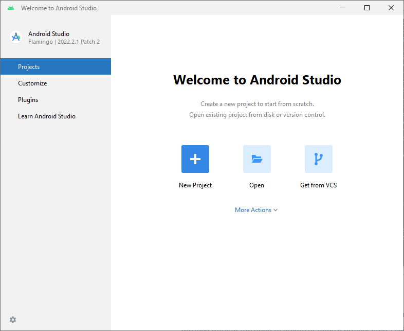
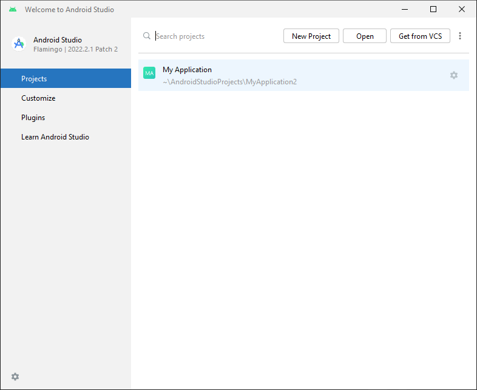
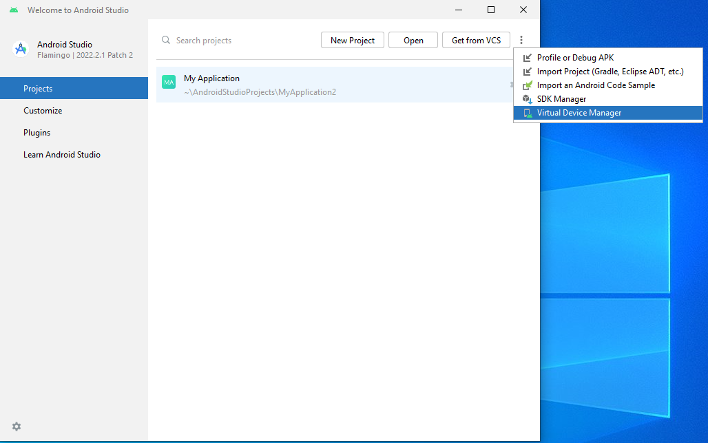
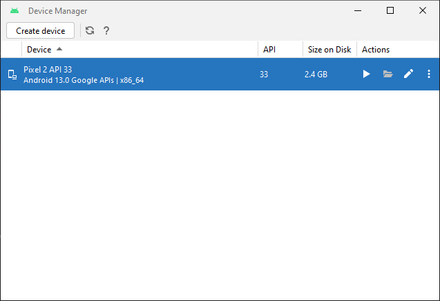

# 10 - Run the emulator in Android Studio
 

To run the emulator in Android Studio Flamingo, you can follow these steps:

1. Open Android Studio Flamingo.

2. Click on the "AVD Manager" icon in the toolbar. It looks like a mobile device with an Android logo.

3. The "Android Virtual Device Manager" window will open.

4. Click on the "Create Virtual Device" button.

5. Choose a device definition from the list and click "Next". If you don't have any device definitions, you may need to create one first by clicking on the "Create New Virtual Device" button and following the instructions.

6. Select the desired system image (the Android version you want to emulate) and click "Next".

7. Customize any other settings you want, such as device name and storage size, and click "Finish".

8. In the "Android Virtual Device Manager" window, you will see the newly created virtual device. Select it and click the "Play" button (green triangle) to launch the emulator.

9. Wait for the emulator to start. It may take some time depending on your computer's performance.

10. Once the emulator is running, you can test your app by deploying it to the virtual device directly from Android Studio.

That's it! You should now have the emulator running in Android Studio Flamingo and be able to test your Android apps on it.

In Android Studio Flamingo, you can open the AVD Manager without creating or opening a project by following these steps:

1. Open Android Studio Flamingo.

2. In the Welcome screen, click on the "Configure" button at the bottom right corner.

3. From the dropdown menu, select "AVD Manager".

4. The "Android Virtual Device Manager" window will open, allowing you to manage your virtual devices.

5. From here, you can create, edit, and launch virtual devices without needing to have a project open.

By accessing the AVD Manager directly from the Welcome screen, you can work with virtual devices without the need to create or open a project first. This can be useful for managing and testing virtual devices independently.