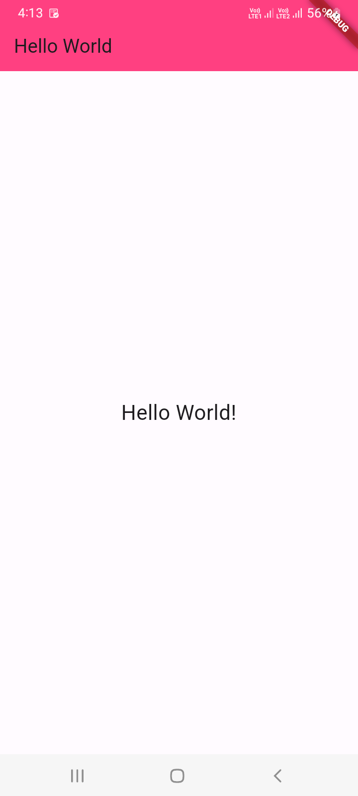

# Chapter 11 - HelloWorld
 
1. open `HelloWorldScreen.dart`

```
import 'package:flutter/material.dart';

class HelloWorldScreen extends StatelessWidget {

  @override
  Widget build(BuildContext context) {

    return Scaffold(

      appBar: AppBar(
        title: Text('Hello World'),
        backgroundColor: Colors.pinkAccent,
      ),
      
      body: const Center(
        child: Text(
          'Hello World!',
          style: TextStyle(fontSize: 24),
        ),
      ),

    );

  }
  
}
```

2. open `main.dart`

```
import 'package:flutter/material.dart';

import 'package:untitled/screens/HelloWorldScreen.dart';

void main() {
  runApp(MyApp());
}

class MyApp extends StatelessWidget {
  @override
  Widget build(BuildContext context) {
    return MaterialApp(
      debugShowCheckedModeBanner: false,
      home: HelloWorldScreen(),
    );
  }
}
```

