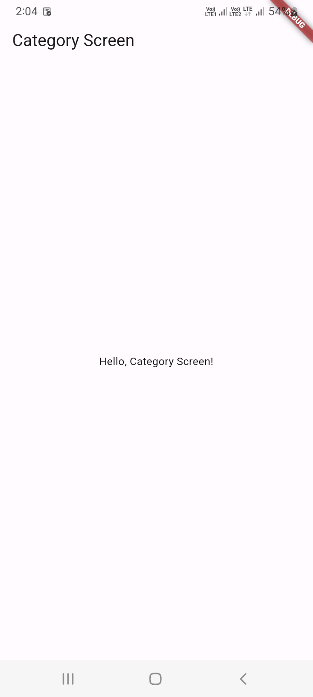
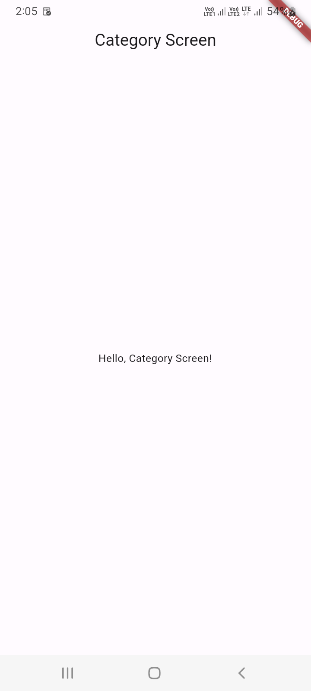
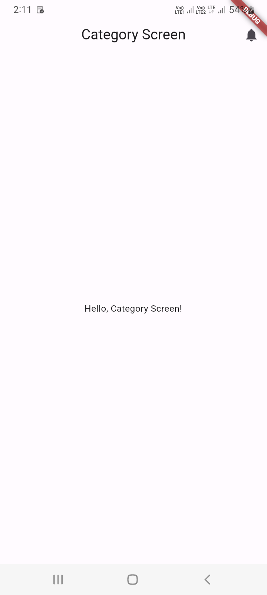
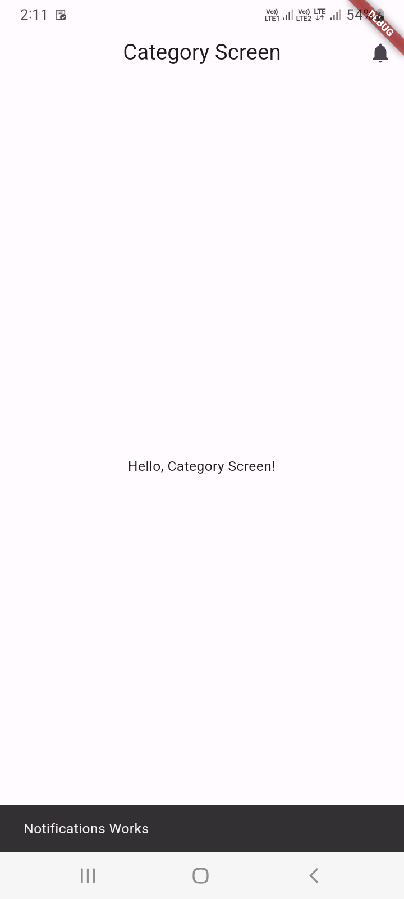
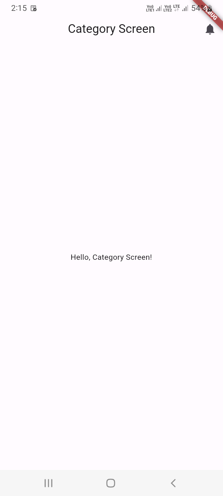
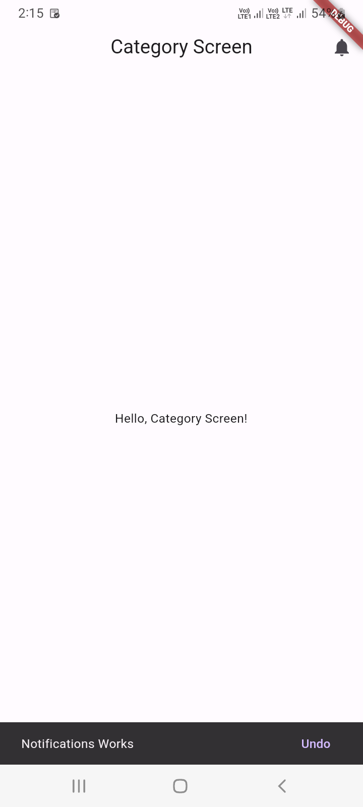
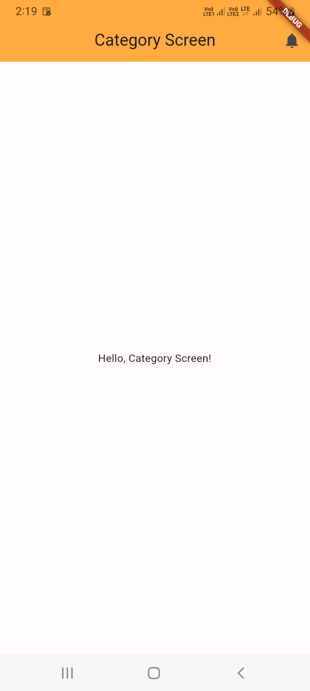

# 14 - Flutter AppBar Widget

1. CategoryScreen.dart - Default App Bar

```
import 'package:flutter/material.dart';

class CategoryScreen extends StatelessWidget {
  
  @override
  Widget build(BuildContext context) {
    
    return Scaffold(
      appBar: AppBar(
        title: Text('Category Screen'),
      ),
      body: Center(
        child: Text('Hello, Category Screen!'),
      ),
    );
    
  }

}
```



3. CategoryScreen.dart - App Bar With Centered Text

```
import 'package:flutter/material.dart';

class CategoryScreen extends StatelessWidget {
  
  @override
  Widget build(BuildContext context) {
    
    return Scaffold(
      appBar: AppBar(
        title: Text('Category Screen'),
        centerTitle: true,
      ),
      body: Center(
        child: Text('Hello, Category Screen!'),
      ),
    );
    
  }

}
```



5. CategoryScreen.dart - App Bar With IconButton, actions

```
import 'package:flutter/material.dart';

class CategoryScreen extends StatelessWidget {
  
  @override
  Widget build(BuildContext context) {
    
    return Scaffold(
      appBar: AppBar(
        title: Text('Category Screen'),
        centerTitle: true,
        actions: <Widget>[
          IconButton( 
            icon: Icon(Icons.notifications),
            onPressed: () {
              ScaffoldMessenger.of(context).showSnackBar(
                SnackBar(content: Text("Notifications Works")),
              );
            },
          )
        ],
      ),
      body: Center(
        child: Text('Hello, Category Screen!'),
      ),
    );
    
  }

}
```




8. CategoryScreen.dart - App Bar With IconButton, actions, label

```
import 'package:flutter/material.dart';

class CategoryScreen extends StatelessWidget {
  
  @override
  Widget build(BuildContext context) {
    
    return Scaffold(
      appBar: AppBar(
        title: Text('Category Screen'),
        centerTitle: true,
        actions: <Widget>[
          IconButton( 
            icon: Icon(Icons.notifications),
            onPressed: () {
              ScaffoldMessenger.of(context).showSnackBar(
                SnackBar(
                  content: Text("Notifications Works"),
                  action: SnackBarAction(
                    label: 'Undo',
                    onPressed: () {},
                    ),
                ),
              );
            },
          )
        ],
      ),
      body: Center(
        child: Text('Hello, Category Screen!'),
      ),
    );
    
  }

}
```




11. CategoryScreen.dart - App Bar With background color

```
import 'package:flutter/material.dart';

class CategoryScreen extends StatelessWidget {
  
  @override
  Widget build(BuildContext context) {
    
    return Scaffold(
      appBar: AppBar(
        title: Text('Category Screen'),
        centerTitle: true,
        actions: <Widget>[
          IconButton( 
            icon: Icon(Icons.notifications),
            onPressed: () {},
          )
        ],
        backgroundColor: Colors.orangeAccent,
        
      ),
      body: Center(
        child: Text('Hello, Category Screen!'),
      ),
    );
    
  }

}
```



13. CategoryScreen.dart - App Bar With Menu Icon

```
import 'package:flutter/material.dart';

class CategoryScreen extends StatelessWidget {
  
  @override
  Widget build(BuildContext context) {
    
    return Scaffold(
      appBar: AppBar(
        title: Text('Category Screen'),
        centerTitle: true,
        actions: <Widget>[
          IconButton( 
            icon: Icon(Icons.notifications),
            onPressed: () {},
          )
        ],
        backgroundColor: Colors.orangeAccent,
        leading: IconButton(
            icon: Icon(Icons.menu),
            onPressed: () {
              ScaffoldMessenger.of(context).showSnackBar(
                SnackBar(
                  content: Text("Menu Works"),
                  action: SnackBarAction(
                    label: 'Undo',
                    onPressed: () {},
                    ),
                ),
              );
            },
        ),
      ),
      body: Center(
        child: Text('Hello, Category Screen!'),
      ),
    );
    
  }

}
```


16. CategoryScreen.dart - App Bar With Rounded Shape

```
import 'package:flutter/material.dart';

class CategoryScreen extends StatelessWidget {
  
  @override
  Widget build(BuildContext context) {
    
    return Scaffold(
      appBar: AppBar(
        title: Text('Category Screen'),
        centerTitle: true,
        actions: <Widget>[
          IconButton( 
            icon: Icon(Icons.notifications),
            onPressed: () {},
          )
        ],
        backgroundColor: Colors.orangeAccent,
        shape: RoundedRectangleBorder(
          borderRadius: BorderRadius.only(
            topLeft: Radius.circular(25),
            topRight: Radius.circular(25),
            bottomLeft: Radius.circular(25),
            bottomRight: Radius.circular(25),
          )
        ),
      ),
      body: Center(
        child: Text('Hello, Category Screen!'),
      ),
    );
    
  }

}
```

