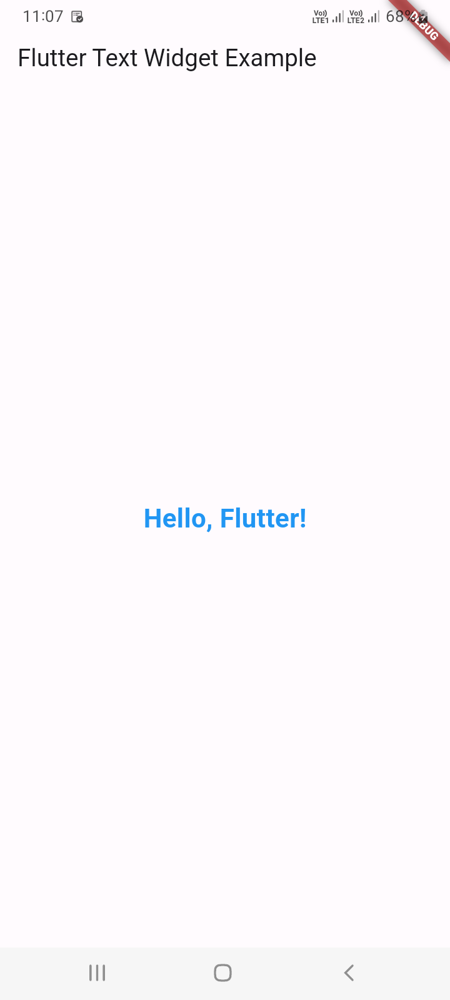

# 17 - Flutter Text Widget
 
1. Flutter Text Widget 
In Flutter, the `Text` widget is used to display a short piece of text. It's a simple and versatile widget 
that allows you to customize the appearance of the text, such as its font, color, alignment, and more. 

Here's a basic example of using the `Text` widget:

```
import 'package:flutter/material.dart';

void main() {
  runApp(MyApp());
}

class MyApp extends StatelessWidget {
  @override
  Widget build(BuildContext context) {
    return MaterialApp(
      home: Scaffold(
        appBar: AppBar(
          title: Text('Flutter Text Widget Example'),
        ),
        body: Center(
          child: Text(
            'Hello, Flutter!',
            style: TextStyle(
              fontSize: 24.0,
              fontWeight: FontWeight.bold,
              color: Colors.blue,
            ),
          ),
        ),
      ),
    );
  }
}
```


In this example:

- The `Text` widget is used to display the text "Hello, Flutter!".
- The `style` property is used to customize the text's appearance, including its font size, weight, and color.

You can further customize the `Text` widget by adjusting various properties such as:

style:
The style of the text. You can set properties like `fontSize`, `fontWeight`, `color`, `fontFamily`, etc.

textAlign:
The alignment of the text within its container. It can be set to values like `left`, `center`, `right`, or `justify`.

maxLines:
The maximum number of lines to display. If null, there is no limit.

overflow:
How to handle text that overflows its container. You can use values like `ellipsis` or `clip` to handle overflow.

textDirection:
The directionality of the text.

- And many more.

Feel free to experiment with different properties based on your design requirements. The `Text` widget is a fundamental building block for displaying text in Flutter applications.

