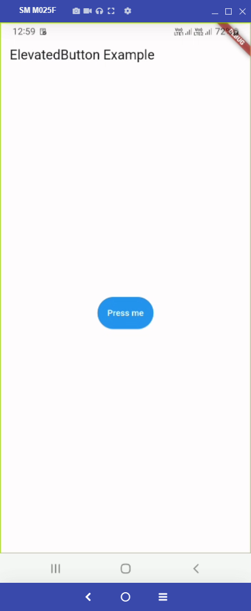
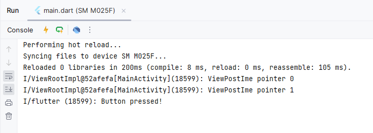
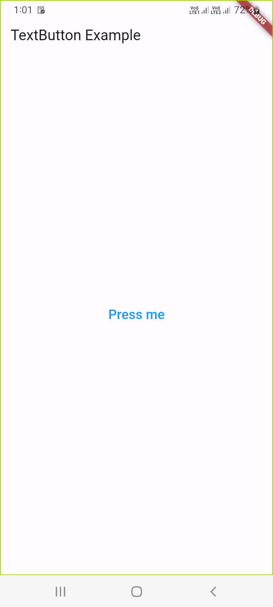
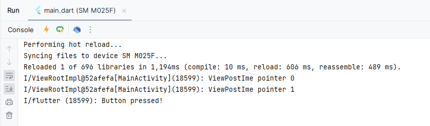

# 18 - Flutter Button Widgets

1. Introduction

In Flutter, the `ElevatedButton` and `TextButton` widgets are commonly used to create buttons. These widgets provide different styles for buttons with different visual effects. Here's a brief overview of how you can use these widgets:

### ElevatedButton:

The `ElevatedButton` widget is typically used for raised buttons. It has a default elevated appearance.

```
ElevatedButton(
  onPressed: () {
    // Handle button press
  },
  child: Text('Press me'),
)
```

You can customize the appearance of the `ElevatedButton` using the `style` property:

```
ElevatedButton(
  onPressed: () {
    // Handle button press
  },
  style: ElevatedButton.styleFrom(
    // Add styling properties here
    primary: Colors.blue, // Background color
    onPrimary: Colors.white, // Text color
  ),
  child: Text('Press me'),
)
```

### TextButton:

The `TextButton` widget is used for flat-style buttons with no elevation.

```
TextButton(
  onPressed: () {
    // Handle button press
  },
  child: Text('Press me'),
)
```

You can also customize the appearance of the `TextButton` using the `style` property:

```
TextButton(
  onPressed: () {
    // Handle button press
  },
  style: TextButton.styleFrom(
    // Add styling properties here
    primary: Colors.blue, // Text color
  ),
  child: Text('Press me'),
)
```

These are just basic examples, and you can further customize the buttons by adjusting other properties like `padding`, `onLongPress`, `focusNode`, etc. Explore the Flutter documentation for these widgets to discover more customization options: [ElevatedButton](https://api.flutter.dev/flutter/material/ElevatedButton-class.html) and [TextButton](https://api.flutter.dev/flutter/material/TextButton-class.html).


2. ElevatedButton

Here's a complete Flutter code example that demonstrates the use of `ElevatedButton`:

```
import 'package:flutter/material.dart';

void main() {
  runApp(MyApp());
}

class MyApp extends StatelessWidget {
  @override
  Widget build(BuildContext context) {
    return MaterialApp(
      home: Scaffold(
        appBar: AppBar(
          title: Text('ElevatedButton Example'),
        ),
        body: Center(
          child: ElevatedButton(
            onPressed: () {
              // Handle button press
              print('Button pressed!');
            },
            style: ElevatedButton.styleFrom(
              primary: Colors.blue, // Background color
              onPrimary: Colors.white, // Text color
              padding: EdgeInsets.all(16.0), // Padding around the button content
            ),
            child: Text('Press me'),
          ),
        ),
      ),
    );
  }
}
```

In this example, we create a simple Flutter app with an `AppBar` and a `Center` widget containing an `ElevatedButton`. The `ElevatedButton` is customized with a blue background color, white text color, and additional padding. When the button is pressed, a message is printed to the console. You can copy and run this code in your Flutter environment to see the `ElevatedButton` in action.





5. TextButton

Here's an example of a Flutter app that uses the `TextButton` widget:

```
import 'package:flutter/material.dart';

void main() {
  runApp(MyApp());
}

class MyApp extends StatelessWidget {
  @override
  Widget build(BuildContext context) {
    return MaterialApp(
      home: Scaffold(
        appBar: AppBar(
          title: Text('TextButton Example'),
        ),
        body: Center(
          child: TextButton(
            onPressed: () {
              // Handle button press
              print('Button pressed!');
            },
            style: TextButton.styleFrom(
              primary: Colors.blue, // Text color
              backgroundColor: Colors.grey[300], // Background color
              padding: EdgeInsets.all(16.0), // Padding around the button
            ),
            child: Text(
              'Press me',
              style: TextStyle(fontSize: 20.0),
            ),
          ),
        ),
      ),
    );
  }
}
```

In this example, we've created a simple Flutter app with a `TextButton` widget. The button is styled using the `style` property to set the text color, background color, and padding. The `onPressed` callback is where you can handle the button press event.

Feel free to customize the code further based on your needs and explore additional properties available in the `TextButton.styleFrom` and `Text` widgets.



