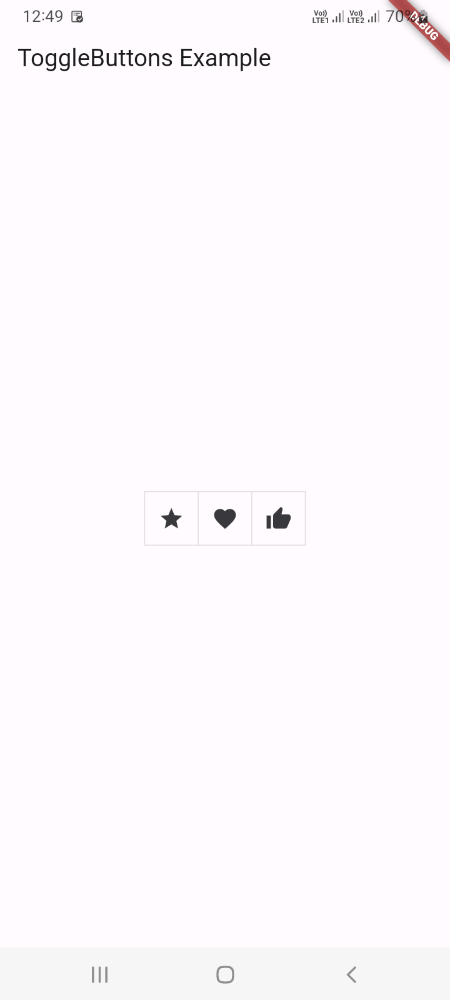
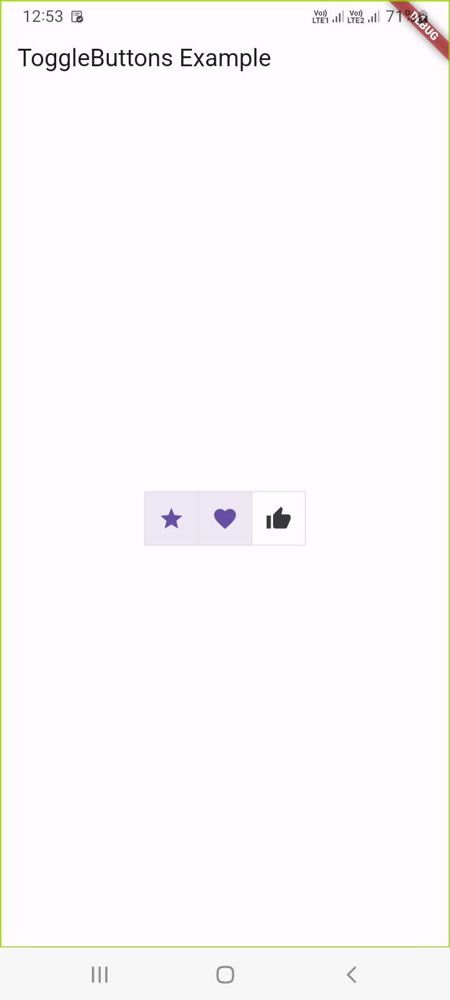
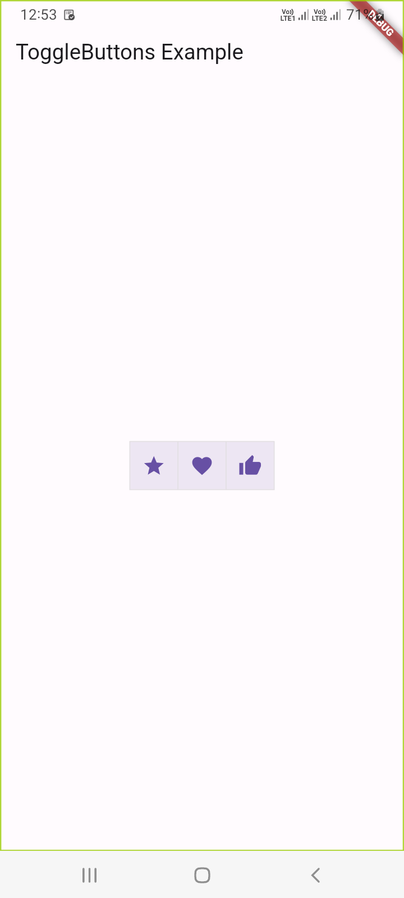
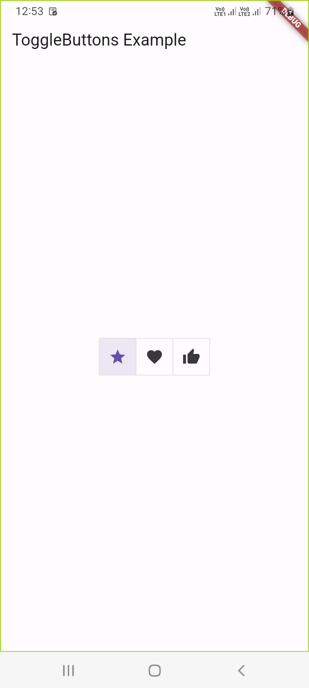

# 19 - Flutter ToggleButtons Widget

1. Flutter ToggleButtons Widget

In Flutter, the `ToggleButtons` widget is a useful widget that provides a set of buttons that can be toggled on or off. It is often used when you have a set of options, and the user can select multiple options at once. The `ToggleButtons` widget is part of the Flutter material library.

Here's a basic example of how you can use the `ToggleButtons` widget in Flutter:

```
import 'package:flutter/material.dart';

void main() {
  runApp(MyApp());
}

class MyApp extends StatelessWidget {
  @override
  Widget build(BuildContext context) {
    return MaterialApp(
      home: Scaffold(
        appBar: AppBar(
          title: Text('ToggleButtons Example'),
        ),
        body: ToggleButtonsExample(),
      ),
    );
  }
}

class ToggleButtonsExample extends StatefulWidget {
  @override
  _ToggleButtonsExampleState createState() => _ToggleButtonsExampleState();
}

class _ToggleButtonsExampleState extends State<ToggleButtonsExample> {
  List<bool> isSelected = [false, false, false];

  @override
  Widget build(BuildContext context) {
    return Center(
      child: ToggleButtons(
        children: [
          Icon(Icons.star),
          Icon(Icons.favorite),
          Icon(Icons.thumb_up),
        ],
        isSelected: isSelected,
        onPressed: (int index) {
          setState(() {
            isSelected[index] = !isSelected[index];
          });
        },
      ),
    );
  }
}
```

In this example, we have a simple `ToggleButtons` widget with three icons (star, heart, and thumb up). The `isSelected` list keeps track of the selected state for each button. The `onPressed` callback is triggered when a button is pressed, and it toggles the selected state.

You can customize the appearance of the `ToggleButtons` by providing your own list of children (widgets), adjusting the `isSelected` list, and handling the `onPressed` callback accordingly.











