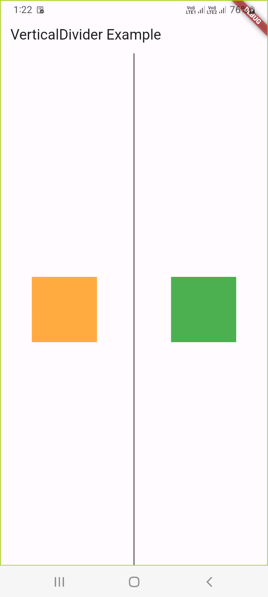

# 21 - Flutter VerticalDivider Widget
 
1. Flutter VerticalDivider Widget

As of my last knowledge update in January 2022, Flutter's `VerticalDivider` widget provides a vertical line to visually separate content within a Flutter application. Please note that there may have been updates or changes to Flutter after my last training data in January 2022.

Here's a basic example of how you can use the `VerticalDivider` widget:

import 'package:flutter/material.dart';

void main() {
  runApp(MyApp());
}

class MyApp extends StatelessWidget {
  @override
  Widget build(BuildContext context) {
    return MaterialApp(
      home: Scaffold(
        appBar: AppBar(
          title: Text('VerticalDivider Example'),
        ),
        body: Center(
          child: Row(
            mainAxisAlignment: MainAxisAlignment.spaceEvenly,
            children: <Widget>[
              Container(
                width: 100,
                height: 100,
                color: Colors.orangeAccent,
              ),
              VerticalDivider(
                color: Colors.black,
                thickness: 1,
              ),
              Container(
                width: 100,
                height: 100,
                color: Colors.green,
              ),
            ],
          ),
        ),
      ),
    );
  }
}

In this example, a `Row` widget is used to arrange two containers horizontally, and a `VerticalDivider` is placed between them. The `VerticalDivider` takes parameters like `color` and `thickness` to customize its appearance.

Please check the official Flutter documentation or any updates in the Flutter framework beyond my last knowledge update for the most accurate and current information.

