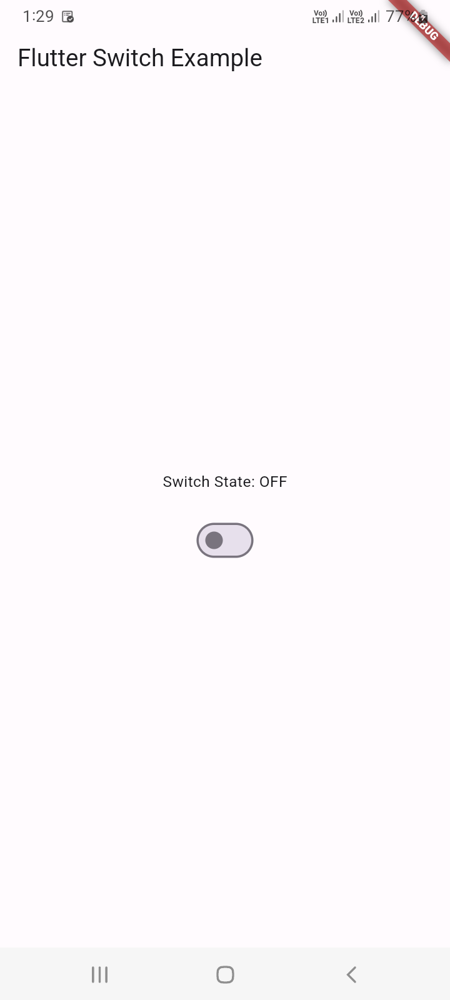
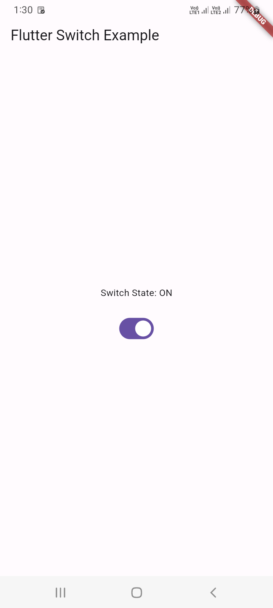

# Chapter 22 - Flutter Switch Widget
 
1. Flutter Switch Widget

In Flutter, the `Switch` widget is used to create a toggle switch, which is essentially a button that can be in one of two states: on or off. It's commonly used for binary settings or options where users can enable or disable a feature. Here's a basic example of how you can use the `Switch` widget in Flutter:

```dart
import 'package:flutter/material.dart';

void main() {
  runApp(MyApp());
}

class MyApp extends StatelessWidget {
  @override
  Widget build(BuildContext context) {
    return MaterialApp(
      home: Scaffold(
        appBar: AppBar(
          title: Text('Flutter Switch Example'),
        ),
        body: Center(
          child: SwitchWidget(),
        ),
      ),
    );
  }
}

class SwitchWidget extends StatefulWidget {
  @override
  _SwitchWidgetState createState() => _SwitchWidgetState();
}

class _SwitchWidgetState extends State<SwitchWidget> {
  bool switchValue = false;

  @override
  Widget build(BuildContext context) {
    return Column(
      mainAxisAlignment: MainAxisAlignment.center,
      children: [
        Text('Switch State: ${switchValue ? 'ON' : 'OFF'}'),
        SizedBox(height: 20),
        Switch(
          value: switchValue,
          onChanged: (value) {
            setState(() {
              switchValue = value;
            });
          },
        ),
      ],
    );
  }
}
```

In this example:

1. We create a simple Flutter app with an `AppBar` and a `SwitchWidget` as the main content.
2. The `SwitchWidget` is a stateful widget that contains a `Switch` widget and a `Text` widget to display the state of the switch.
3. The `Switch` widget has a `value` property, which is set to the current state (`switchValue`) and an `onChanged` callback, which is triggered when the user interacts with the switch. In the callback, we update the state to reflect the new value of the switch.

You can customize the appearance of the switch using properties like `activeColor`, `inactiveThumbColor`, `activeTrackColor`, `inactiveTrackColor`, etc. Adjust the `Switch` widget according to your design preferences and requirements.



