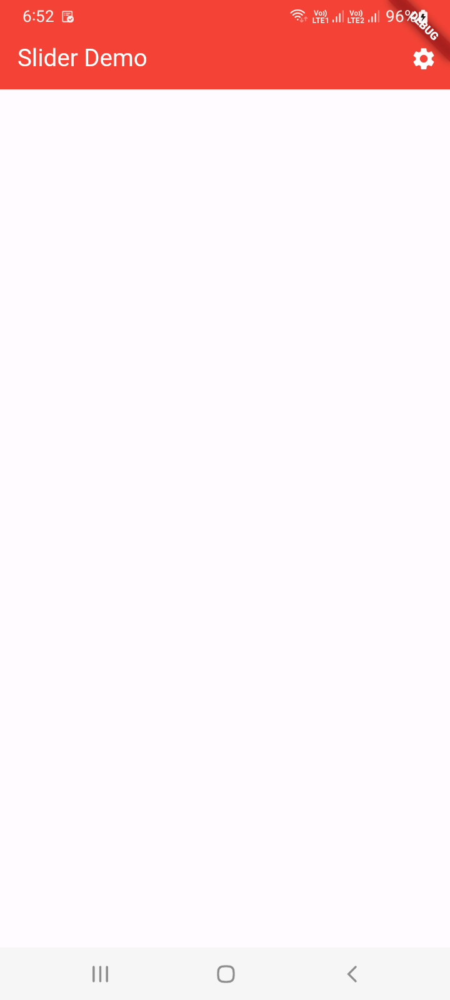

# 23 - Flutter Appbar Action

```
import 'package:flutter/material.dart';

void main() {
  runApp(MyApp());
}

class MyApp extends StatelessWidget {
  @override
  Widget build(BuildContext context) {
    return MaterialApp(
      home: HomePage(),
    );
  }
}

class HomePage extends StatefulWidget {
  @override
  _HomePageState createState() => _HomePageState();
}

class _HomePageState extends State<HomePage> {
  @override
  Widget build(BuildContext context) {
    return Scaffold(
      appBar: AppBar(
        backgroundColor: Colors.red,
        title: Text(
            'Slider Demo',style: TextStyle(color: Colors.white)
        ),
        actions: <Widget>[
          IconButton(
            icon: Icon(Icons.settings, color: Colors.white),
            onPressed: () {},
          )
        ],
      ),
      body: Container(
        // Add your body content here
      ),
    );
  }
}
```



