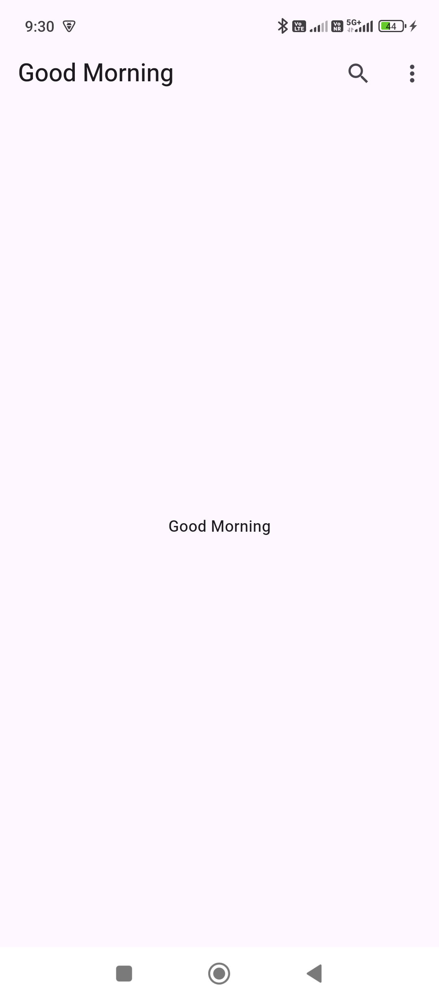
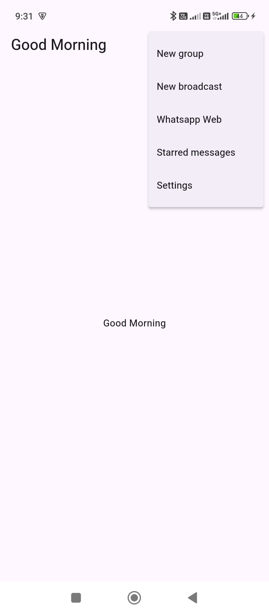

```dart
import 'package:flutter/material.dart';

class HomeScreen extends StatefulWidget {
  const HomeScreen({super.key});

  @override
  State<HomeScreen> createState() => _HomeScreenState();
}

class _HomeScreenState extends State<HomeScreen> {
  @override
  Widget build(BuildContext context) {
    return Scaffold(
      appBar: AppBar(
        title: const Text("WhatsApp"),
        actions: [
          IconButton(icon: const Icon(Icons.search), onPressed: () {}),
          PopupMenuButton<String>(
              onSelected: (value) {
                print(value);
              },
              itemBuilder: (BuildContext context) {
                return [
                  PopupMenuItem(child: Text("New group"), value: "New group",),
                  PopupMenuItem(child: Text("New broadcast"), value: "New broadcast",),
                  PopupMenuItem(child: Text("Whatsapp Web"), value: "Whatsapp Web",),
                  PopupMenuItem(child: Text("Starred messages"), value: "Starred messages",),
                  PopupMenuItem(child: Text("Settings"), value: "Settings",),
                ];
              })
        ],
      ),
      body: Center(
        child: Text("data"),
      ),
    );
  }
}
```

```dart
import 'package:flutter/material.dart';

import 'package:untitled1/screens/HomeScreen.dart';

void main() {
  runApp(const MyApp());
}

class MyApp extends StatelessWidget {
  const MyApp({super.key});

  @override
  Widget build(BuildContext context) {
    return MaterialApp(
      home: HomeScreen(),
    );
  }
}
```


