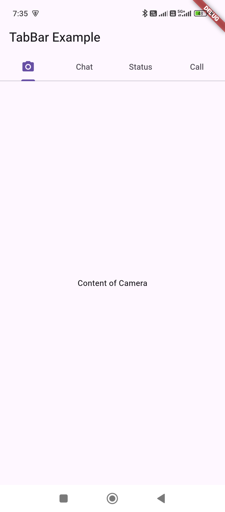
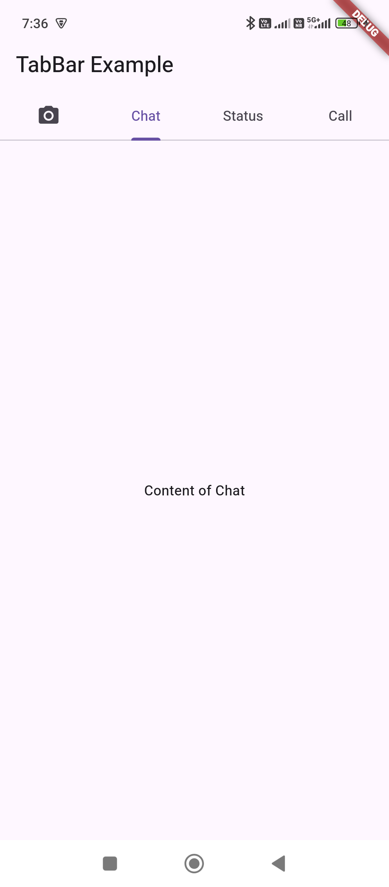
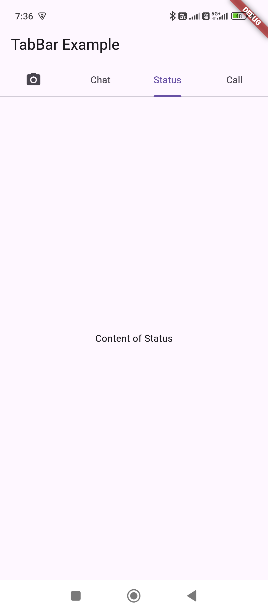
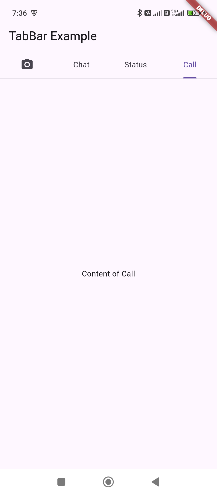

```dart
import 'package:flutter/material.dart';
import 'package:untitled/screens/HomeScreen.dart';

void main() {
  runApp(const MyApp());
}

class MyApp extends StatelessWidget {
  const MyApp({super.key});

  // This widget is the root of your application.
  @override
  Widget build(BuildContext context) {
    return MaterialApp(
      home: HomeScreen(),
    );
  }
}
```

```dart
import 'package:flutter/material.dart';

class HomeScreen extends StatefulWidget {
  @override
  _HomeScreenState createState() => _HomeScreenState();
}

class _HomeScreenState extends State<HomeScreen> with SingleTickerProviderStateMixin {
  late TabController _tabController;

  @override
  void initState() {
    super.initState();
    _tabController = TabController(length: 4, vsync: this);
  }

  @override
  void dispose() {
    _tabController.dispose();
    super.dispose();
  }

  @override
  Widget build(BuildContext context) {
    return Scaffold(
      appBar: AppBar(
        title: Text("TabBar Example"),
        bottom: TabBar(
          controller: _tabController,
          tabs: [
            Tab(
              icon: Icon(Icons.camera_alt),
            ),
            Tab(text: "Chat"),
            Tab(text: "Status"),
            Tab(text: "Call"),
          ],
        ),
      ),
      body: TabBarView(
        controller: _tabController,
        children: [
          Center(child: Text("Content of Camera")),
          Center(child: Text("Content of Chat")),
          Center(child: Text("Content of Status")),
          Center(child: Text("Content of Call")),
        ],
      ),
    );
  }
}
```




