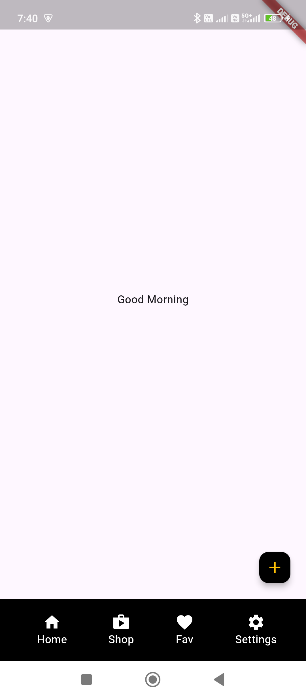

```dart
import 'package:flutter/material.dart';

class HomeScreen extends StatelessWidget {

  const HomeScreen({super.key});

  @override
  Widget build(BuildContext context) {
    return Scaffold(
      floatingActionButton: FloatingActionButton(
          child: Icon(Icons.add),
          onPressed: (){},
          backgroundColor: Colors.black,
          foregroundColor: Colors.amber,
          mini: true,
      ),
      bottomNavigationBar: BottomAppBar(
         color: Colors.black,
          child: Row(
            mainAxisAlignment: MainAxisAlignment.spaceAround,
            mainAxisSize: MainAxisSize.max,
            children: [
              Padding(
                padding: const EdgeInsets.only(left: 10.0),
                child: Column(
                  mainAxisSize: MainAxisSize.min,
                  children: [
                    Icon(
                      Icons.home,
                      color: Colors.white,
                    ),
                    Text(
                        'Home',
                        style: TextStyle(color: Colors.white),
                    )
                  ],
                ),
              ),
              Padding(
                padding: const EdgeInsets.only(left: 10.0),
                child: Column(
                  mainAxisSize: MainAxisSize.min,
                  children: [
                    Icon(
                      Icons.shop,
                      color: Colors.white,
                    ),
                    Text(
                      'Shop',
                      style: TextStyle(color: Colors.white),
                    )
                  ],
                ),
              ),
              Padding(
                padding: const EdgeInsets.only(left: 10.0),
                child: Column(
                  mainAxisSize: MainAxisSize.min,
                  children: [
                    Icon(
                      Icons.favorite,
                      color: Colors.white,
                    ),
                    Text(
                      'Fav',
                      style: TextStyle(color: Colors.white),
                    )
                  ],
                ),
              ),
              Padding(
                padding: const EdgeInsets.only(left: 10.0),
                child: Column(
                  mainAxisSize: MainAxisSize.min,
                  children: [
                    Icon(
                      Icons.settings,
                      color: Colors.white,
                    ),
                    Text(
                      'Settings',
                      style: TextStyle(color: Colors.white),
                    )
                  ],
                ),
              )
            ],
          ),
      ),
      body: Center(
        child: Text('Good Morning'),
      ),
    );
  }
}
```

