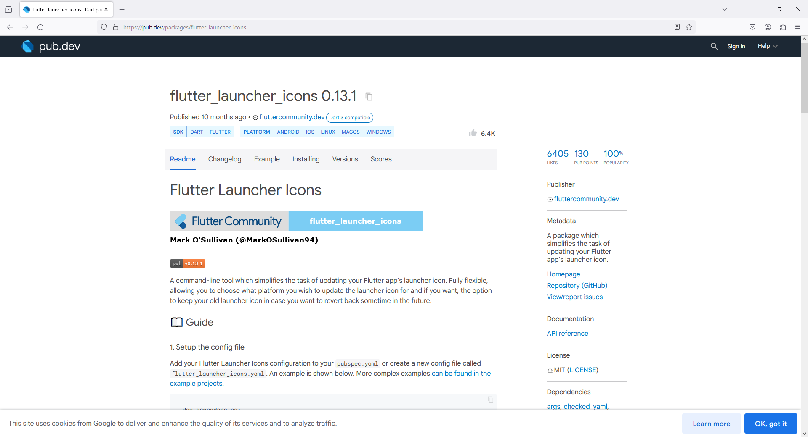
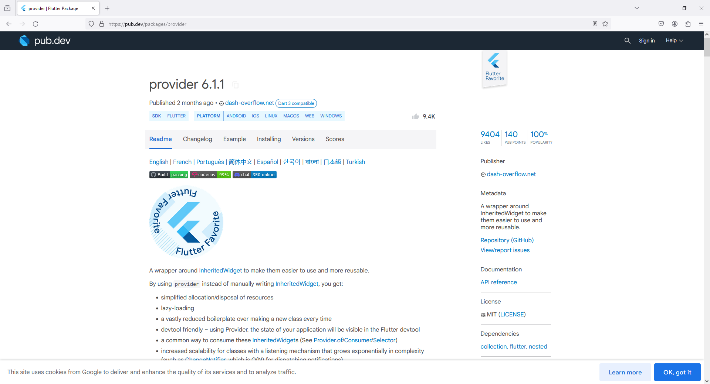
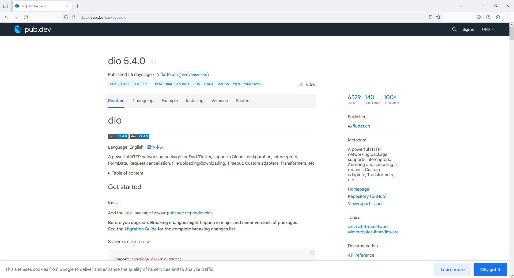
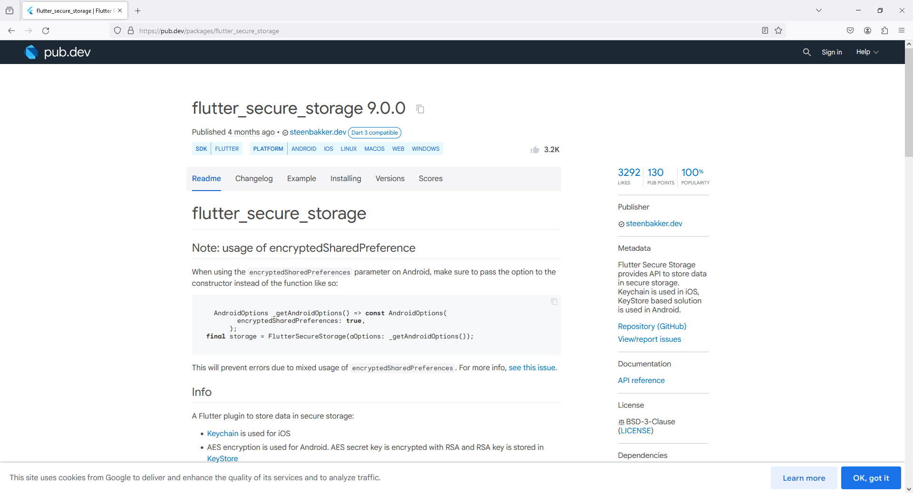
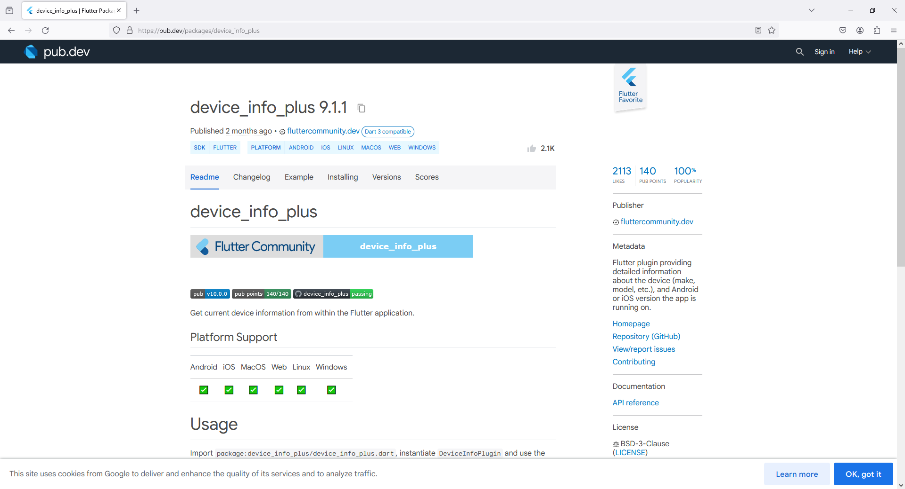

# 1 - Folder Setup

lib -> util

lib -> services

lib -> models

lib -> screens


File Setup

lib -> util -> Constants.dart

lib -> services -> dio.dart

lib -> services -> auth.dart

lib -> models -> User.dart

lib -> screens -> HomeScreen.dart

lib -> screens -> LoginScreen.dart

# 2 - Package Setup

flutter launcher icons

```
https://pub.dev/packages/flutter_launcher_icons
```

provider

```
https://pub.dev/packages/provider
```

dio

```
https://pub.dev/packages/dio
```

flutter secure storage

```
https://pub.dev/packages/flutter_secure_storage
```

device info plus

```
https://pub.dev/packages/device_info_plus
```









