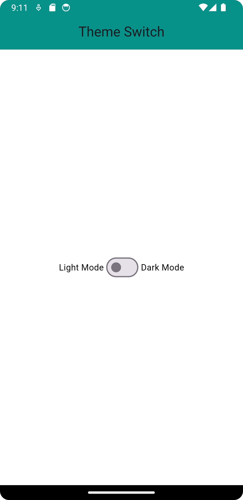
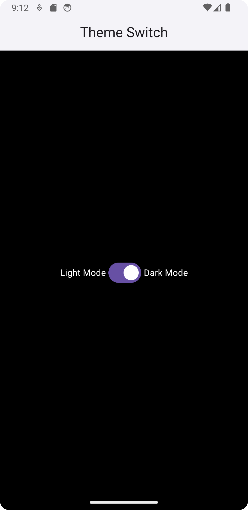

# https://www.youtube.com/watch?v=iCbakAjWnaI

# https://pub.dev/packages/hooks_riverpod/install

```
flutter pub add hooks_riverpod
```

1. Folder Structure

```
lib -> util

lib -> services

lib -> screens


File Setup

lib -> util -> AppTheme.dart

lib -> services -> ThemeProvider.dart

lib -> screens -> HomeScreen.dart
```

`AppTheme.dart`

```dart
import 'package:flutter/material.dart';

class AppTheme {

  static final lightTheme = ThemeData(
    scaffoldBackgroundColor: Colors.white,
    appBarTheme: const AppBarTheme(
      color: Colors.teal,
      iconTheme: IconThemeData(
        color: Colors.white
      )
    ),
    textTheme: const TextTheme(
      bodyMedium: TextStyle(
        color: Colors.black
      )
    )
  );

  static final darkTheme = ThemeData(
      scaffoldBackgroundColor: Colors.black,
      appBarTheme: const AppBarTheme(
          color: Colors.white,
          iconTheme: IconThemeData(
              color: Colors.white
          )
      ),
      textTheme: const TextTheme(
          bodyMedium: TextStyle(
              color: Colors.white
          )
      )
  );

}
```

`ThemeProvider.dart`

```dart
import 'package:flutter/material.dart';

import 'package:hooks_riverpod/hooks_riverpod.dart';

final AppThemeStateNotifier = ChangeNotifierProvider(
    (ref) => AppThemeState()
);

class AppThemeState extends ChangeNotifier {

  var isDarkModeEnabled = false;

  void setLightTheme() {
    isDarkModeEnabled = false;
    notifyListeners();
  }

  void setDarkTheme() {
    isDarkModeEnabled = true;
    notifyListeners();
  }

}
```

`HomeScreen.dart`

```dart
import 'package:flutter/material.dart';
import 'package:hooks_riverpod/hooks_riverpod.dart';

import '../services/ThemeProvider.dart';

class HomeScreen extends StatelessWidget {
  const HomeScreen({super.key});

  @override
  Widget build(BuildContext context) {
    return Scaffold(
      appBar: AppBar(
        elevation: 2.0,
        centerTitle: true,
        title: const Text("Theme Switch"),
      ),
      body: Column(
        children: [
          Expanded(
            child: Row(
              mainAxisAlignment: MainAxisAlignment.center,
              children: [
                Text("Light Mode"),
                DarkModeSwitch(),
                Text("Dark Mode"),
              ],
            ),
          ),
        ],
      ),
    );
  }
}


class DarkModeSwitch extends HookConsumerWidget {

  const DarkModeSwitch({Key? key}) : super(key: key);

  @override
  Widget build(BuildContext context,WidgetRef ref) {

    // Watch the appThemeState to get the current theme mode
    final appThemeState = ref.watch(AppThemeStateNotifier);

    return Switch(
      value: appThemeState.isDarkModeEnabled,
      onChanged: (enabled) {
        if (enabled) {
          appThemeState.setDarkTheme();
        } else {
          appThemeState.setLightTheme();
        }
      },
    );
  }
}
```

`main.dart`

```dart
import 'package:flutter/material.dart';
import 'package:hello_world/screens/HomeScreen.dart';
import 'package:hello_world/services/ThemeProvider.dart';
import 'package:hello_world/util/AppTheme.dart';
import 'package:hooks_riverpod/hooks_riverpod.dart';

void main() {
  // runApp(const MyApp());

  runApp(const ProviderScope(child: MyApp()));
}


class MyApp extends HookConsumerWidget {
  const MyApp({Key? key}) : super(key: key);

  @override
  Widget build(BuildContext context, WidgetRef ref) {
    // Watch the appThemeState to get the current theme mode
    final appThemeState = ref.watch(AppThemeStateNotifier);

    return MaterialApp(
      debugShowCheckedModeBanner: false,
      theme: AppTheme.lightTheme,
      darkTheme: AppTheme.darkTheme,
      // Use ThemeMode to determine if the app should be in dark or light mode
      themeMode: appThemeState.isDarkModeEnabled ? ThemeMode.dark : ThemeMode.light,
      home: HomeScreen(),
    );
  }
}
```



